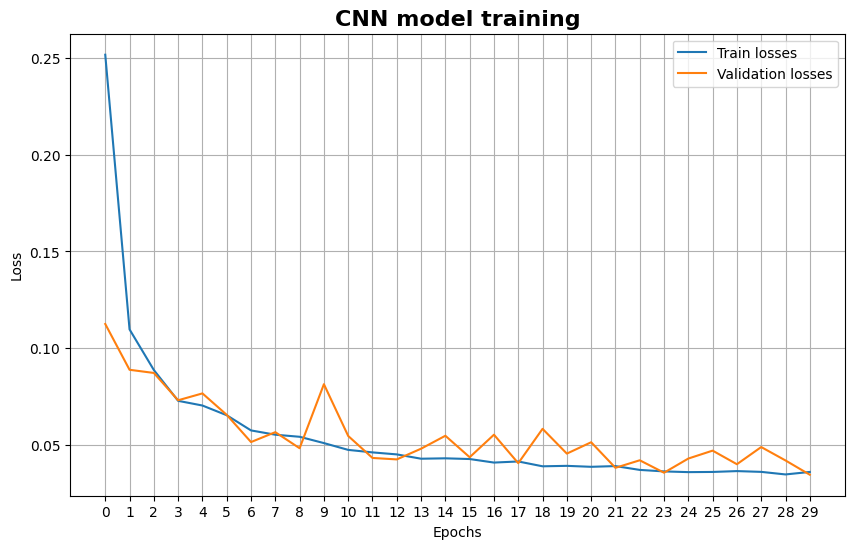
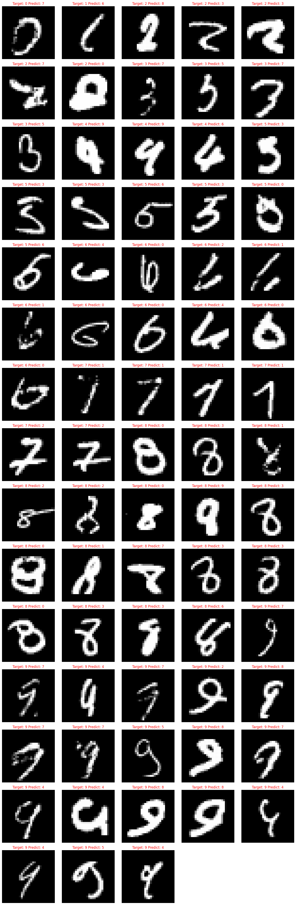

# CNN Model


```python
import torch
from torchvision.transforms import v2
from torch.utils import data
import numpy as np
import matplotlib.pyplot as plt

from src.MNISTDataset import MNISTDataset
from src.model import ModelCNN
from src.train import Trainer
from src.evaluate import Evaluation
```

    Using device: mps


```python
model = ModelCNN()
mean = 0.1307
std = 0.3081
transformers = v2.Compose([v2.RandomRotation(10), v2.RandomAffine(0, translate=[0.1, 0.1]), v2.ToImage(), v2.Grayscale(), v2.ToDtype(dtype=torch.float32), v2.Normalize((mean,), (std,))])
train_dataset = MNISTDataset(path='data', train=True, transforms=transformers)

dataset_val, dataset_train = data.random_split(dataset=train_dataset, lengths=[0.3, 0.7])
dl_train = data.DataLoader(dataset=dataset_train, batch_size=32, shuffle=True)
dl_val = data.DataLoader(dataset=dataset_val, batch_size=len(dataset_val))
    
loss_func = torch.nn.CrossEntropyLoss()
optimizer = torch.optim.Adam(params=model.parameters(), lr=0.001, weight_decay=0.0001)
```


```python
trainer = Trainer(model, 'CNN Model', epochs=30, loss_func=loss_func, optimizer=optimizer, train_set=dl_train, val_set=dl_val)
model = trainer.train()
```

                                                                                      

    Epoch [1/30] | loss_mean=0.252, Q_val=0.112


                                                                                      

    Epoch [2/30] | loss_mean=0.110, Q_val=0.089


                                                                                      

    Epoch [3/30] | loss_mean=0.089, Q_val=0.087


                                                                                      

    Epoch [4/30] | loss_mean=0.073, Q_val=0.073


                                                                                      

    Epoch [5/30] | loss_mean=0.070, Q_val=0.077


                                                                                      

    Epoch [6/30] | loss_mean=0.065, Q_val=0.065


                                                                                      

    Epoch [7/30] | loss_mean=0.057, Q_val=0.051


                                                                                      

    Epoch [8/30] | loss_mean=0.055, Q_val=0.056


                                                                                      

    Epoch [9/30] | loss_mean=0.054, Q_val=0.048


                                                                                       

    Epoch [10/30] | loss_mean=0.051, Q_val=0.081


                                                                                       

    Epoch [11/30] | loss_mean=0.047, Q_val=0.054


                                                                                       

    Epoch [12/30] | loss_mean=0.046, Q_val=0.043


                                                                                       

    Epoch [13/30] | loss_mean=0.045, Q_val=0.042


                                                                                       

    Epoch [14/30] | loss_mean=0.043, Q_val=0.048


                                                                                       

    Epoch [15/30] | loss_mean=0.043, Q_val=0.055


                                                                                       

    Epoch [16/30] | loss_mean=0.043, Q_val=0.043


                                                                                       

    Epoch [17/30] | loss_mean=0.041, Q_val=0.055


                                                                                       

    Epoch [18/30] | loss_mean=0.041, Q_val=0.040


                                                                                       

    Epoch [19/30] | loss_mean=0.039, Q_val=0.058


                                                                                       

    Epoch [20/30] | loss_mean=0.039, Q_val=0.045


                                                                                       

    Epoch [21/30] | loss_mean=0.039, Q_val=0.051


                                                                                       

    Epoch [22/30] | loss_mean=0.039, Q_val=0.038


                                                                                       

    Epoch [23/30] | loss_mean=0.037, Q_val=0.042


                                                                                       

    Epoch [24/30] | loss_mean=0.036, Q_val=0.035


                                                                                       

    Epoch [25/30] | loss_mean=0.036, Q_val=0.043


                                                                                       

    Epoch [26/30] | loss_mean=0.036, Q_val=0.047


                                                                                       

    Epoch [27/30] | loss_mean=0.036, Q_val=0.040


                                                                                       

    Epoch [28/30] | loss_mean=0.036, Q_val=0.049


                                                                                       

    Epoch [29/30] | loss_mean=0.035, Q_val=0.042


                                                                                       

    Epoch [30/30] | loss_mean=0.036, Q_val=0.034


```python
trainer.train_plot('CNN model training', save=True)
```


    

    


```python
model.load_state_dict(torch.load('models/CNN Model_20.tar'))
model.eval()
test_dataset = MNISTDataset(path='data', train=False, transforms=v2.Compose([v2.ToImage(), v2.Grayscale(), v2.ToDtype(dtype=torch.float32), v2.Normalize((mean,), (std,))]))

evaluation = Evaluation(model, test_dataset)
evaluation.accuracy()
evaluation.precision_recall()
evaluation.f1();

```

    Accuracy score: 0.99
    Precision score: 0.99
    Recall score: 0.99
    F1 score: 0.99


```python
test_loader = data.DataLoader(dataset=test_dataset, batch_size=64)
incorrect_predictions = []
model = model.cpu()
with torch.no_grad():
    for images, labels in test_loader:
        true_labels_idx = torch.argmax(labels, dim=1)

        outputs = model(images)
        probabilities = torch.softmax(outputs, dim=1)
        predicted_classes_idx = torch.argmax(probabilities, dim=1)

        for i in range(images.size(0)):
            if predicted_classes_idx[i] != true_labels_idx[i]:
                denormalized_image = (images[i].cpu().numpy() * std) + mean

                incorrect_predictions.append({
                    'image': denormalized_image.squeeze(), 
                    'true_label': true_labels_idx[i].item(),
                    'predicted_label': predicted_classes_idx[i].item()
                })

print(f'Найдено {len(incorrect_predictions)} ошибочных предсказаний')

```

    Найдено 73 ошибочных предсказаний (из 10 000)


```python
if incorrect_predictions:
    num_display = len(incorrect_predictions)

    fig, axes = plt.subplots(int(np.ceil(num_display / 5)), 5, figsize=(15, int(np.ceil(num_display / 5)) * 3))
    axes = axes.flatten()
    for i in range(num_display):
        item = incorrect_predictions[i]
        ax = axes[i]
        ax.imshow(item['image'], cmap='gray') 
        ax.set_title(f"Target: {item['true_label']} Predict: {item['predicted_label']}", color='red')
        ax.axis('off')

    for j in range(num_display, len(axes)):
        fig.delaxes(axes[j])

    plt.tight_layout()
    plt.show()
```


    

    

